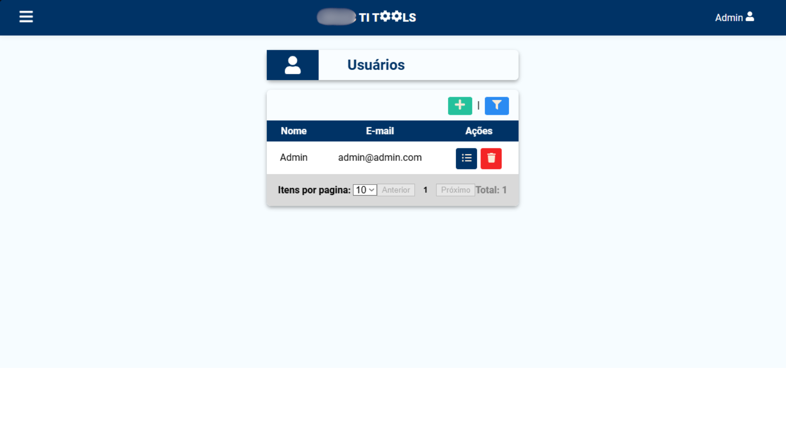

# TiTools Web

Aplicação web frontend do **TiTools**, um sistema desenvolvido para auxiliar a equipe de TI de uma instituição de ensino no gerenciamento de equipamentos tecnológicos e empréstimos de notebooks para utilização acadêmica.

O frontend foi desenvolvido utilizando **React.js** e é responsável pela interface de interação com os usuários, comunicação com a API, gerenciamento de estado, autenticação e geração de documentos e relatórios.

> **Projeto real em operação:** o TiTools foi desenvolvido para solucionar um problema recorrente relacionado ao controle e extravio de equipamentos. Antes de sua implementação, ocorria aproximadamente um extravio de equipamento por ano. Após a implementação do sistema, não foram registrados novos casos de extravio.

---

## 📌 Sobre o projeto

O TiTools Web faz parte de uma arquitetura composta por duas aplicações independentes:

```text
┌──────────────────────────┐
│      TiTools Web         │
│     React + Vite         │
└────────────┬─────────────┘
             │
             │ HTTP / REST
             │ JWT Bearer
             ▼
┌──────────────────────────┐
│      TiTools API         │
│    ASP.NET Core 8        │
└────────────┬─────────────┘
             │
             ▼
┌──────────────────────────┐
│         MySQL 8          │
└──────────────────────────┘
```

Este repositório contém exclusivamente a aplicação frontend.

### Repositório do backend

A API responsável pelas regras de negócio e persistência dos dados está disponível em:

**[TiTools API](https://github.com/leosilva1999/titoolsapi)**

---

## ✨ Funcionalidades

A aplicação web disponibiliza interfaces para:

- 🔐 Autenticação de usuários
- 🏠 Página inicial
- 💻 Cadastro, consulta, atualização e exclusão de equipamentos
- 📦 Controle de empréstimos
- 👥 Gerenciamento de usuários
- 🏷️ Geração e impressão de etiquetas
- 📄 Geração de documentos PDF
- 📊 Geração e exportação de relatórios
- 🔎 Filtros e consultas de equipamentos, empréstimos e usuários
- 📑 Paginação de registros
- 🔑 Controle de acesso baseado em autenticação e autorização

---

## 🖥️ Screenshots

### Login


### Página inicial


### Equipamentos


### Empréstimos


### Usuários



### Impressão de etiquetas


### Relatórios


---

## 🏗️ Arquitetura do frontend

O frontend foi organizado de maneira a separar componentes visuais, páginas, gerenciamento de estado, serviços e funcionalidades auxiliares.

Uma representação simplificada da comunicação da aplicação é:

```text
                  React Application
                         │
           ┌─────────────┴─────────────┐
           │                           │
           ▼                           ▼
        Pages                     Components
           │                           │
           └─────────────┬─────────────┘
                         │
                         ▼
                  Redux / Services
                         │
                         │ HTTP
                         ▼
                  TiTools API
```

A estrutura principal do projeto está organizada em:

```text
src/
├── assets/
├── components/
├── hooks/
├── Layout/
├── pages/
├── QueryFilter/
├── redux/
├── reports/
├── services/
├── slices/
└── utils/
```

### Components

Contém componentes reutilizáveis e componentes responsáveis por funcionalidades específicas da aplicação.

Entre eles:

```text
AddEquipment
AddLoan
AddUser
DeleteEquipment
DeleteLoan
DeleteUser
FinishLoan
GenerateEquipmentReport
GenerateLabels
GenerateLoanReport
Pagination
PdfLabels
PdfTable
ReleaseEquipment
UpdateEquipment
UpdateLoan
UpdateUser
```

Também existem componentes de estrutura da interface, como:

```text
Footer
Navbar
Sidebar
UserMenu
Modal
```

### Pages

Contém as principais páginas da aplicação:

```text
pages/
├── Auth/
├── Equipment/
├── EquipmentList/
├── Home/
├── LoanList/
└── Users/
```

### QueryFilter

Contém componentes responsáveis pelos filtros utilizados nas consultas:

```text
QueryFilter/
├── EquipmentsQueryFilter
├── LoansQueryFilter
└── UsersQueryFilter
```

### Redux

O gerenciamento de estado global utiliza **Redux Toolkit**.

Os principais slices são:

```text
slices/
├── authSlice.js
├── equipmentSlice.js
└── loanSlice.js
```

Esses slices são utilizados para organizar o estado relacionado à autenticação, equipamentos e empréstimos.

### Services

Responsável pela comunicação da aplicação com os serviços externos, principalmente a API do TiTools.

### Reports

Contém funcionalidades relacionadas à geração dos relatórios utilizados pela aplicação.

### Utils

Concentra funções auxiliares e utilitários utilizados por diferentes partes da aplicação.

---

## 🔐 Autenticação

A autenticação é realizada através de **JWT (JSON Web Token)** fornecido pela API.

O fluxo simplificado é:

```text
Usuário
   │
   │ Login
   ▼
React
   │
   │ Credenciais
   ▼
TiTools API
   │
   │ JWT
   ▼
React
   │
   │ Armazena token
   ▼
localStorage
```

Nas requisições autenticadas, o token é enviado no header HTTP:

```http
Authorization: Bearer <token>
```

O frontend também utiliza a biblioteca `jwt-decode` para trabalhar com informações presentes no token JWT.

---

## 🔄 Integração com a API

A comunicação entre o frontend e o backend é realizada através de requisições HTTP para a API REST do TiTools.

O endereço da API é definido no arquivo:

```text
config.jsx
```

Exemplo:

```javascript
export const api = "http://localhost:8080/api";
```

O endereço pode ser alterado conforme o ambiente em que a aplicação estiver sendo executada.

A aplicação utiliza o token JWT nas requisições que necessitam de autenticação.

---

## 📄 Geração de documentos e relatórios

O frontend possui funcionalidades para geração e exportação de informações.

Entre os recursos utilizados estão:

### PDF

A biblioteca `@react-pdf/renderer` é utilizada para geração de documentos PDF.

### QR Code

A biblioteca `qrcode` é utilizada para geração de QR Codes relacionados aos equipamentos.

### Excel

A biblioteca `xlsx` é utilizada para trabalhar com dados e exportações em formato de planilha.

Esses recursos são utilizados principalmente nas funcionalidades de **etiquetas e relatórios**.

---

## 🛠️ Tecnologias utilizadas

### Frontend

| Tecnologia | Utilização |
|---|---|
| React 18 | Construção da interface |
| Vite | Ferramenta de desenvolvimento e build |
| React Router DOM | Roteamento da aplicação |
| Redux Toolkit | Gerenciamento de estado |
| React Redux | Integração do Redux com React |
| JWT Decode | Leitura de informações do JWT |
| React PDF | Geração de documentos PDF |
| QRCode | Geração de QR Codes |
| XLSX | Exportação e manipulação de planilhas |
| React Select | Componentes de seleção |
| React Toastify | Notificações |
| date-fns | Manipulação de datas |
| React Icons | Ícones |

### Ferramentas

- Node.js
- npm
- ESLint
- Docker
- Docker Compose
- Nginx

---

## 📁 Estrutura do projeto

A estrutura principal do projeto é:

```text
titoolsweb/
│
├── docs/
│   └── screenshots/
│
├── src/
│   ├── assets/
│   │
│   ├── components/
│   │   ├── AddEquipment/
│   │   ├── AddLoan/
│   │   ├── AddUser/
│   │   ├── DeleteEquipment/
│   │   ├── DeleteLoan/
│   │   ├── DeleteUser/
│   │   ├── FinishLoan/
│   │   ├── GenerateEquipmentReport/
│   │   ├── GenerateLabels/
│   │   ├── GenerateLoanReport/
│   │   ├── Modal/
│   │   ├── Navbar/
│   │   ├── Pagination/
│   │   ├── PdfLabels/
│   │   ├── PdfTable/
│   │   ├── ReleaseEquipment/
│   │   ├── Sidebar/
│   │   ├── UpdateEquipment/
│   │   ├── UpdateLoan/
│   │   ├── UpdateUser/
│   │   └── UserMenu/
│   │
│   ├── hooks/
│   ├── Layout/
│   │
│   ├── pages/
│   │   ├── Auth/
│   │   ├── Equipment/
│   │   ├── EquipmentList/
│   │   ├── Home/
│   │   ├── LoanList/
│   │   └── Users/
│   │
│   ├── QueryFilter/
│   │   ├── EquipmentsQueryFilter/
│   │   ├── LoansQueryFilter/
│   │   └── UsersQueryFilter/
│   │
│   ├── redux/
│   ├── reports/
│   ├── services/
│   ├── slices/
│   └── utils/
│
├── Dockerfile
├── docker-compose.yml
├── nginx.conf
├── package.json
└── vite.config.js
```

---

## ⚙️ Pré-requisitos

Para executar o projeto localmente, é necessário ter instalado:

- [Node.js](https://nodejs.org/)
- npm
- Git

Para executar através de Docker:

- Docker
- Docker Compose

Além disso, é necessário que a **TiTools API** esteja disponível para que a aplicação consiga realizar suas operações.

---

## 🚀 Executando localmente

Clone o repositório:

```bash
git clone https://github.com/leosilva1999/titoolsweb.git
```

Entre no diretório:

```bash
cd titoolsweb
```

Instale as dependências:

```bash
npm install
```

Configure o endereço da API no arquivo `config.jsx`:

```javascript
export const api = "http://localhost:8080/api";
```

Execute a aplicação em modo de desenvolvimento:

```bash
npm run dev
```

O Vite disponibilizará a aplicação no endereço informado no terminal, normalmente:

```text
http://localhost:5173
```

---

## 🐳 Executando com Docker

O frontend possui uma imagem Docker baseada em **multi-stage build**.

O processo é dividido em duas etapas:

```text
Node.js
   │
   │ npm install
   │ npm run build
   ▼
Arquivos estáticos /dist
   │
   ▼
Nginx
   │
   ▼
Container final
```

O primeiro estágio utiliza Node.js para instalar as dependências e gerar o build de produção.

O segundo estágio utiliza Nginx para servir os arquivos estáticos gerados pelo Vite.

### Executando

Na raiz do projeto:

```bash
docker compose up --build
```

O frontend será disponibilizado através da porta `8080`:

```text
http://localhost:8080
```

Para executar o container em segundo plano:

```bash
docker compose up --build -d
```

Para interromper os containers:

```bash
docker compose down
```

---

## 📦 Build de produção

Para gerar o build da aplicação manualmente:

```bash
npm run build
```

Os arquivos de produção serão gerados no diretório:

```text
dist/
```

Para visualizar o build localmente utilizando o Vite:

```bash
npm run preview
```

---

## 📜 Scripts disponíveis

Os principais scripts definidos no `package.json` são:

| Comando | Descrição |
|---|---|
| `npm run dev` | Inicia o servidor de desenvolvimento |
| `npm run build` | Gera o build de produção |
| `npm run lint` | Executa a análise estática do código |
| `npm run preview` | Executa uma prévia do build de produção |

---

## 📱 Responsividade

A aplicação foi desenvolvida principalmente com foco em **uso desktop**, considerando o contexto operacional da equipe responsável pela TI.

---

## 🧪 Testes

Atualmente, o frontend não possui uma suíte de testes automatizados configurada.

---

## 📊 Status do projeto

O escopo principal do TiTools está **concluído**.

A aplicação encontra-se em operação em uma escola da rede e atualmente passa principalmente por:

- correções de bugs;
- manutenção;
- ajustes pontuais.

Não existe um roadmap de novas funcionalidades definido neste momento.

---

## 📚 Conhecimentos desenvolvidos

O desenvolvimento do frontend proporcionou experiência prática em:

- React.js
- Vite
- Redux Toolkit
- gerenciamento de estado global
- React Router
- autenticação baseada em JWT
- integração com APIs REST
- geração de documentos PDF
- geração de QR Codes
- exportação de dados
- componentes reutilizáveis
- organização de aplicações frontend
- Docker
- Nginx
- integração frontend/backend

O projeto também proporcionou experiência no desenvolvimento de uma aplicação utilizada em um ambiente real, indo além de um projeto exclusivamente acadêmico ou de estudo.

---

## 🔗 Projetos relacionados

### Backend

**TiTools API**

ASP.NET Core Web API responsável pelas regras de negócio, autenticação, autorização e persistência dos dados.

https://github.com/leosilva1999/titoolsapi

### Frontend

**TiTools Web**

Aplicação React responsável pela interface do sistema.

https://github.com/leosilva1999/titoolsweb

---

## 👨‍💻 Autor

**Leonardo Pereira**

Desenvolvedor .NET

- GitHub: https://github.com/leosilva1999
- LinkedIn: https://www.linkedin.com/in/leonardo-pereira-da-silva-67399b191
- E-mail: leopereirasilva86@gmail.com

---

## 📄 Licença

Este projeto não possui uma licença de código aberto definida atualmente.